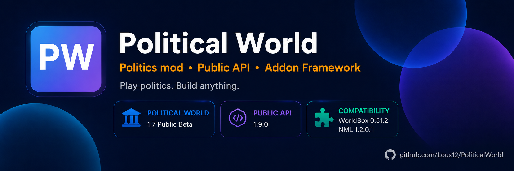

  

<h1 align="center">Political World</h1>

<strong>Политический мод для WorldBox • Public API • платформа для аддонов</strong>

  <a href="README.md">English</a> ·
  <a href="https://lous12.github.io/PoliticalWorld/">Сайт</a> ·
  <a href="https://steamcommunity.com/sharedfiles/filedetails/?id=3780484869">Steam Workshop</a> ·
  <a href="https://discord.gg/kYH5GadndE">Discord</a> ·
  <a href="https://github.com/Lous12/PoliticalWorld/discussions">Discussions</a>

# Текущий статус

- **Political World:** 1.11.0
- **Public API:** 1.19.0
- **Целевой build WorldBox:** 719
- **NeoModLoader:** 1.2.0.1
- **Текущий фокус:** планирование 1.12 и поддержка после релиза 1.11

## Что появилось в 1.11

- Прогрессия рангов монархии от малых титулов до королевства и империи.
- Исправлена смена правителя после выборов в республиках.
- Внутренние партийные фракции и динамические расколы.
- Отколовшиеся партии могут переходить к близким идеологиям, а при тяжёлых кризисах — переживать более резкий идеологический разрыв.
- Политические альянсы / избирательные блоки, которые объединяют поддержку на выборах и могут со временем распадаться.
- Улучшено долгосрочное появление партий.

Спасибо участникам Discord-сервера, чьи идеи и баг-репорты вошли в 1.11: **@Asriel**, **@Mauro**, **@Mars**.

## Быстрые ссылки

- [Сайт проекта](https://lous12.github.io/PoliticalWorld/)
- [Steam Workshop](https://steamcommunity.com/sharedfiles/filedetails/?id=3780484869)
- [Discord](https://discord.gg/kYH5GadndE)
- [Первый аддон](docs/ru/GETTING_STARTED.md)
- [Справочник API 1.19](docs/ru/API_REFERENCE_1_19.md)
- [Куда развивается API](docs/ru/FRAMEWORK_VISION.md)
- [Аддоны сообщества](https://lous12.github.io/PoliticalWorld/ru/community-addons.html)
- [Discussions](https://github.com/Lous12/PoliticalWorld/discussions)

## Для игроков

Political World добавляет идеологии, партии, правительства, выборы, политическую стабильность, сепаратизм, политические кризисы, международные блоки, саммиты, подготовку к войне, политические режимы карты, динамические названия стран, политику поселений и долгосрочную эволюцию партий.

## Для разработчиков

PoliticalWorldAPI 1.19 включает регистрацию аддонов, capability discovery, локализацию, данные и теги, события, редкие политические события, actions, реестры идеологий и правительств, доступ к партиям и государствам, warfare helpers, UI integration, lifecycle мира, release helpers и диагностику.

Исходники публичного API находятся в `src/PoliticalWorld/API/`.

## Open source, форки и вклад в проект

Political World открыт под MIT License. Форки, патчи, PR, эксперименты и помощь с ИИ приветствуются.

Для работы с core сначала прочитайте:

- [AGENTS.md](AGENTS.md)
- [ARCHITECTURE.md](ARCHITECTURE.md)
- [KNOWN_RISKS.md](KNOWN_RISKS.md)
- [DEVELOPMENT.md](DEVELOPMENT.md)

Форки должны явно указывать, что они неофициальные, и сохранять исходный текст MIT License.

## Сообщество

Для обычного общения, тестов и предложений удобнее Discord. GitHub Discussions остаётся местом для API-вопросов, тестирования аддонов и длинных технических обсуждений.

## Поддержать проект

Political World, Public API и документация остаются бесплатными. Добровольная поддержка:

- [DonationAlerts](https://www.donationalerts.com/r/lous12)
- [DALink](https://dalink.to/lous12)

## Лицензия

Проект распространяется под [MIT License](LICENSE).
