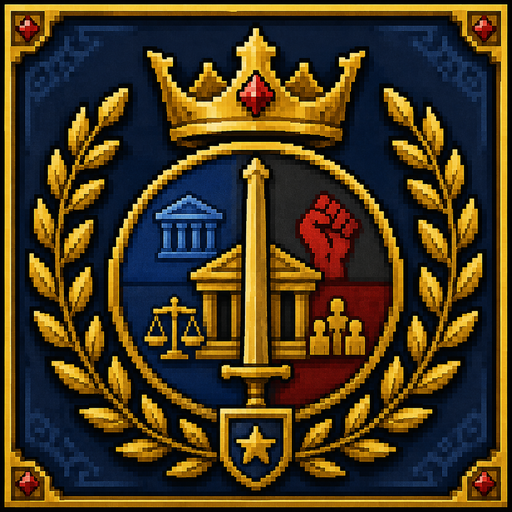

<p align="center">
  
</p>

<h1 align="center">Political World</h1>

<p align="center"><strong>Play politics. Build anything.</strong></p>

<p align="center">
  A WorldBox political expansion and an open addon framework for creators.
</p>

<p align="center">
  <a href="https://steamcommunity.com/sharedfiles/filedetails/?id=3780484869"><strong>Steam Workshop</strong></a> ·
  <a href="en/README.md"><strong>English Docs</strong></a> ·
  <a href="ru/README.md"><strong>Русская документация</strong></a> ·
  <a href="https://github.com/Lous12/PoliticalWorld/discussions"><strong>Discussions</strong></a> ·
  <a href="en/community-addons.md"><strong>Community Addons</strong></a> ·
  <a href="https://github.com/Lous12/PoliticalWorld"><strong>GitHub</strong></a>
</p>

---

## Two sides of one project

### 🎮 Political World for players

Political World adds a lightweight political layer to WorldBox:

- ideologies and ideological currents;
- parties and party leaders;
- governments and political systems;
- elections, councils and leadership changes;
- stability, crises, coups, rebellions and revolutions;
- blocs and vanilla Alliance integration;
- physical ruler summits;
- war preparation and war exhaustion;
- Political Map modes.

**[Install Political World from Steam Workshop →](https://steamcommunity.com/sharedfiles/filedetails/?id=3780484869)**

### 🧩 PoliticalWorldAPI for creators

Political World is also an open addon framework.

The public API provides reusable systems for registration, localization fallback, data, tags, events, conditions, effects, actions, diagnostics and Political World gameplay integration.

The goal is bigger than political addons:

> **Political World should not decide what kind of mod you are allowed to create.**

```text
WorldBox + NeoModLoader
        ↓
Political World
        ↓
PoliticalWorldAPI 1.9
        ↓
Your addon
```

A creator can start with politics today and increasingly use the same framework for fantasy, religion, economy, events, tools, character systems and other ideas as the general API expands.

**[Read the framework vision →](en/FRAMEWORK_VISION.md)**  
**[Видение фреймворка →](ru/FRAMEWORK_VISION.md)**

## Localization should not block creativity

An addon does not need to translate every language before it can work.

If a player uses Russian but an addon only provides English text, PoliticalWorldAPI can fall back to readable English instead of treating missing translation as incompatibility.

The preferred order is:

```text
current-language translation
        ↓
registered/default localization
        ↓
English fallback
        ↓
DisplayName / Description
        ↓
safe readable ID
```

Translation remains welcome — it simply is not a barrier to making a working addon.

## What can you build?

Start tiny or build a complete ecosystem.

Today the public API already supports political extensions, Actions, Rare Events, addon data/tags, reusable Conditions/Effects, localization and cross-addon event listening.

The framework direction is intended to support projects such as:

- ideology or government packs;
- fantasy systems;
- religions and cults;
- economy and trade;
- disease/disaster mechanics;
- character and dynasty systems;
- scenario/director tools;
- creator utilities;
- integrations between independent addons.

Not every example above is a built-in Political World feature yet. They represent what the general framework is being designed to enable.

**[See what you can build →](en/what-you-can-build.md)**  
**[Что можно создавать →](ru/what-you-can-build.md)**

## Start creating

| I want to... | Start here |
|---|---|
| Make my first addon | [First addon in 10 minutes](en/GETTING_STARTED.md) |
| Сделать первый аддон | [Первый аддон за 10 минут](ru/GETTING_STARTED.md) |
| Understand the framework direction | [Framework vision](en/FRAMEWORK_VISION.md) |
| Add an ideology | [Ideologies](en/ideologies.md) |
| Add a government | [Governments](en/governments.md) |
| Create Actions / Events | [Political events](en/political-events.md) |
| Build a standalone NML mod | [Standalone NML starter](en/standalone-nml-starter.md) |
| Create with an AI assistant | [Using AI](en/using-ai.md) |

## Creator philosophy

Political World is being built around a few rules:

- **Public API first.** First-party addons should follow the same rules as community addons.
- **No mandatory localization.** Missing translations should fall back gracefully.
- **No required per-frame polling.** Prefer events and registered behavior.
- **No internal-class dependency.** `Main`, `ScenarioBridge` and internals are not the public contract.
- **Small projects matter.** One event can be a real addon.
- **Do not make us the bottleneck.** The framework should expose primitives, not require the maintainer to implement every possible system.

## Community

Political World has a community space on GitHub Discussions.

Creators can:

- ask for modding help;
- show WIP projects;
- request API capabilities;
- submit addons for compatibility testing;
- share finished projects.

**[Open Discussions →](https://github.com/Lous12/PoliticalWorld/discussions)**  
**[Community Addons →](en/community-addons.md)**

Verified community addons are added to the catalog after compatibility testing on a supported Political World setup.

## AI-assisted development

The repository is structured so coding assistants can start from documentation instead of guessing how the core works.

Recommended instruction:

```text
Read Political World's AI_START_HERE.md and relevant API docs.
Use only the public PoliticalWorldAPI for Political World addons.
Do not depend on internal Main or ScenarioBridge classes.
Use namespaced IDs, capability checks, events and addon-private data.
If the API lacks a capability, report the missing capability instead of bypassing it.
```

## Open source

Political World is released under the **MIT License**.

You may study the source, fork it, build addons, create tools and continue development, while preserving the required MIT copyright/license notice for MIT-covered code.

## Support

- **[DonationAlerts](https://www.donationalerts.com/r/lous12)**
- **[DALink](https://dalink.to/lous12)**

---

**Political World 1.7 Public Beta · PoliticalWorldAPI 1.9 · WorldBox PC 0.51.2 · NeoModLoader 1.2.0.1**
