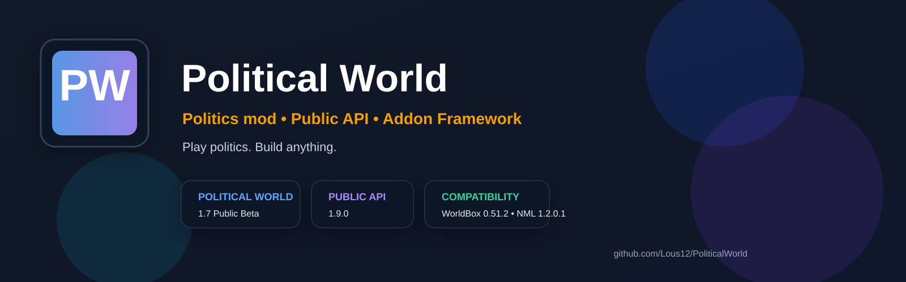

  

# Political World

<strong>Play politics. Build anything.</strong>

  <a href="https://steamcommunity.com/sharedfiles/filedetails/?id=3780484869">Steam Workshop</a> ·
  <a href="https://github.com/Lous12/PoliticalWorld">GitHub</a> ·
  <a href="https://github.com/Lous12/PoliticalWorld/discussions">Discussions</a> ·
  <a href="en/README.md">English docs</a> ·
  <a href="ru/README.md">Русская документация</a>

---

## One project, two audiences

| For players | For creators |
|---|---|
| Political ideologies and parties | Public API 1.19 |
| Governments and political systems | Addon registration |
| Crises, coups and revolutions | Data, tags and diagnostics |
| Blocs, summits and Political Map | Event Bus, Actions, Rare Events |
| A politics mod for WorldBox | A growing addon framework |

---

## Featured paths

### 🎮 I just want to play
- [Steam Workshop](https://steamcommunity.com/sharedfiles/filedetails/?id=3780484869)
- [What the mod adds](en/README.md#two-sides-of-one-project)

### 🧩 I want to build an addon
- [Getting Started](en/GETTING_STARTED.md)
- [Framework Vision](en/FRAMEWORK_VISION.md)
- [API 1.19 quick reference](en/API_REFERENCE_1_19.md)

### 🌍 Я хочу читать по-русски
- [Документация на русском](ru/README.md)
- [Первый аддон](ru/GETTING_STARTED.md)
- [Куда развивается API](ru/FRAMEWORK_VISION.md)

---

## Visual identity

Use these assets across GitHub, Pages and community posts:

- [`assets/github-banner.svg`](assets/github-banner.svg)
- [`assets/social-preview.svg`](assets/social-preview.svg)

They are simple SVG files, easy to edit later if you want a new color palette or wording.

## Discord

Political World Community: https://discord.gg/kYH5GadndE
